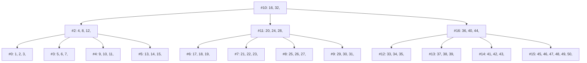

# B+Tree

a simple b+tree implementation in Go for learning purpose



## Todos
- [x] Insertion
- [x] Find
- [ ] Deletion
- [ ] Scan
- [ ] Size
## Usage
```go
tree := NewTree(3)

for i := 1; i <= 10; i++ {
  tree.Put(i)
}

fmt.Println(tree.Print())
// Node 2: 4, 
//  Node 0: 1, 2, 3, 
//  Node 3: 5, 6, 7, 8, 9, 10, 

tree.Find(9) // true
tree.Find(12) // false
```

## Debug
You can use `tree.Mermaid()` to print the mermaid syntax list of the tree. also you can use **Mermaid** `Create()` and `RenderAndDisplay()` to get a valid md file with valid mermaid syntax

```go
m := Mermaid{}
m.Create(tree.Mermaid())
m.RenderAndDisplay()
```